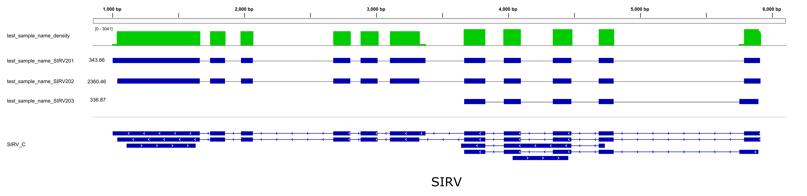

# ESPRESSO

[](https://github.com/Xinglab/espresso/releases/latest)
[](https://github.com/Xinglab/espresso/releases)

## About

ESPRESSO (Error Statistics PRomoted Evaluator of Splice Site Options) is a novel method for processing alignment of long read RNA-seq data, which can effectively improve splice junction accuracy and isoform quantification.

## Table of contents

* [Dependencies](#dependencies)
* [Usage](#usage)
  + [Snakemake](#snakemake)
  + [Basic Usage](#basic-usage)
  + [Example](#example)
  + [Preparing Input Files](#preparing-input-files)
  + [All Arguments](#all-arguments)
* [Output](#output)
* [Visualization](#visualization)
  + [Visualization Arguments](#visualization-arguments)
  + [IGV](#igv)
* [References](#references)

## Dependencies

ESPRESSO requires the following to be installed and available on $PATH:

* [Perl](https://www.perl.org/) >= 5.8 built with threading enabled
  + Check for thread support with `perl -e 'use threads; print("ok\n")'`
  + Requires Storable >= 3.00: https://perldoc.perl.org/Storable#huge-objects
    - Check with `perl -e 'use Storable; print("$Storable::VERSION\n")'`
* [hmmer](http://www.hmmer.org/) >= 3.3.1
* [BLAST](https://blast.ncbi.nlm.nih.gov/Blast.cgi) >= 2.8.1
* [samtools](http://www.htslib.org/) >= 1.6

ESPRESSO requires a sorted SAM or BAM file as input. If the data is in another format then other tools can be used to create the sorted alignment file:

* [minimap2](https://github.com/lh3/minimap2)
* ONT guppy basecaller

The [visualization](visualization/) scripts require

* [UCSC](http://hgdownload.soe.ucsc.edu/admin/exe/) tools
  + bedGraphToBigWig
  + faToTwoBit
  + twoBitInfo
* Python 3
  + [NumPy](https://numpy.org/)

If using the [Snakemake](#snakemake) then its installation script can install the dependencies (except for guppy which requires a login).

## Usage

Please ensure that enough memory is available for the input data and number of threads. The memory usage (in GB) is estimated to be:

* `ESPRESSO_S`: `num_threads * (4 + read_count_of_largest_input/1,000,000)`
* `ESPRESSO_C`: `num_threads * (4 + read_count/2,500,000)`
* `ESPRESSO_Q`: `num_threads * (2 + total_read_count/4,000,000)`

### Snakemake

A Snakemake workflow is provided for running ESPRESSO. See the [README](snakemake/README.md) in [snakemake/](snakemake/) for more details.

### Basic Usage

ESPRESSO has three steps. The basic usage is:

* `perl ESPRESSO_S.pl -L samples.tsv -F ref.fasta -A anno.gtf -O work_dir`
  + samples.tsv is a tab separated file like:
```
/path/to/first.sorted.sam	first_sample_name
/path/to/second.sorted.sam	second_sample_name
```
* `perl ESPRESSO_C.pl -I work_dir -F ref.fasta -X 0`
  + If there are multiple inputs then `ESPRESSO_C` needs to be run once for each input. The -X parameter identifies which input is being processed (-X 0, -X 1, ...)
* `perl ESPRESSO_Q.pl -L work_dir/samples.tsv.updated -A anno.gtf`

### Example

A small test data set is provided in [test_data/test_data_espresso_sirv.tar.gz](test_data/test_data_espresso_sirv.tar.gz). The unpacked files are:

* SIRV2_3.sort.sam: sorted aligned reads
* SIRV2.fasta: reference sequence for SIRV2
* SIRV_C.gtf: annotation of SIRV isoforms

Create a tab separated file that describes the ESPRESSO input. Call that file samples.tsv:
```
/path/to/SIRV2_3.sort.sam	test_sample_name
```

In this example there is only one SAM file. If there were multiple SAM files then each would be on a separate line in samples.tsv. The second column is the sample name and can be used to group multiple input SAM files together in the final output.


Run `ESPRESSO_S` to pre-process the inputs to determine high confidence splice junctions and other info needed for later steps:
```
perl ESPRESSO_S.pl -A SIRV_C.gtf -L samples.tsv -F SIRV2.fasta -O test_sirv
```

This will produce the file `test_sirv/samples.tsv.updated` which assigns target IDs to SAM files. In this example there is only one SAM with ID 0:
```
/path/to/SIRV2_3.sort.sam	test_sample_name	0
```

Run `ESPRESSO_C` to correct and recover splice junctions for each read:
```
perl ESPRESSO_C.pl -I test_sirv -F SIRV2.fasta -X 0 -T 5
```

The -X parameter identifies which input is being processed. In this example there is only a single target ID (0). If there were multiple inputs then `ESPRESSO_C` would be run separately for each ID in samples.tsv.updated.


Run `ESPRESSO_Q` to identify and quantify all isoforms from the reads:
```
perl ESPRESSO_Q.pl -A SIRV_C.gtf -L test_sirv/samples.tsv.updated -V test_sirv/samples_N2_R0_compatible_isoform.tsv
```

The three main output files are in `test_sirv/` and provide details of the three detected isoforms (SIRV201,202,203). See [Output](#output) for a description of the files. The output file `test_sirv/samples_N2_R0_abundance.esp` should be similar to [test_data/expected_sirv_abundance.esp](test_data/expected_sirv_abundance.esp).

The visualization files can be generated with
```
python3 visualization/visualize.py --genome-fasta SIRV2.fasta --updated-gtf test_sirv/samples_N2_R0_updated.gtf --abundance-esp test_sirv/samples_N2_R0_abundance.esp --target-gene SIRV2 --minimum-count 1 --descriptive-name SIRV --output-dir test_sirv/visualization
```



### Preparing Input Files

#### Base Calling

The following is one possible procedure for base calling. Other base calling procedures may be preferable for different data sets. If using Nanopore data then the base calling could be done using guppy with a command similar to:
```
guppy_basecaller --input_path /path/to/fast5 --save_path /path/to/fastq/ --cpu_threads_per_caller 20 --config dna_r9.4.1_450bps_fast.cfg
```

That command assumes that the data is from a Nanopore r9.4.1 cDNA library and it uses the fast mode of guppy with 20 threads. For a Nanopore r9.4.1 direct RNA library `--config rna_r9.4.1_70bps_fast.cfg` could be used.


All the separate .fastq files can be combined into a single file with:
```
cat /path/to/fastq/*.fastq > combined.fastq
```

#### Alignment

One possible alignment tool is Minimap2[1]. This command can output a SAM file without secondary alignments:
```
minimap2 -ax splice -ub --secondary=no ref.fasta combined.fastq > in.sam
```

For noisy 1D Nanopore data the developer of Minimap2 suggests adding -k 14 and -w 4
```
minimap2 -ax splice -ub -k14 -w 4 --secondary=no ref.fasta combined.fastq > in.sam
```

A BED file can be provided to assist the mapping:
```
paftools.js gff2bed anno.gtf > junctions.bed
minimap2 -ax splice -ub -k14 -w 4 --junc-bed junctions.bed --secondary=no ref.fasta combined.fastq > in.sam
```

Only the common format of CIGAR values is accepted by ESPRESSO, so please do **NOT** use parameters to output a specific format of CIGAR values (e.g. --cs in minimap2).

#### Sorted Alignment

The input SAM files need to be sorted by samtools before running ESPRESSO:
```
samtools sort -o sorted.sam unsorted.sam
```

### All Arguments

```
perl ESPRESSO_S.pl --help

Arguments:

    -L, --list_samples
          tsv list of sample(s) (each file in a line with 1st column as sorted
          BAM/SAM file and 2nd column as sample name; required)
    -F, --fa
          FASTA file of all reference sequences. Please make sure this file is
          the same one provided to mapper. (required)
    -A, --anno
          input annotation file in GTF format (optional)
    -B, --SJ_bed
          input custom reliable splice junctions in BED format (optional; each
          reliable SJ in one line, with the 1st column as chromosome, the 2nd
          column as upstream splice site 0-base coordinate, the 3rd column as
          downstream splice site and 6th column as strand)
    -O, --out
          work directory (existing files in this directory may be OVERWRITTEN;
          default: ./)

    -H, --help
          show this help information

    -N, --read_num_cutoff
          min perfect read count for denovo detected candidate splice junctions
          (default: 2)
    -R, --read_ratio_cutoff
          min perfect read ratio for denovo detected candidate splice junctions:
          Set this as 1 for completely GTF-dependent processing (default: 0)

    -C, --cont_del_max
          max continuous deletion allowed; intron will be identified if longer
          (default: 50)
    -M, --chrM
          tell ESPRESSO the ID of mitochondrion in reference file (default:
          chrM)

    -T, --num_thread
          thread number (default: minimum of 5 and sam file number)
    -Q, --mapq_cutoff
          min mapping quality for processing (default: 1)
```

```
perl ESPRESSO_C.pl --help

Arguments:

    -I, --in
          work directory (generated by ESPRESSO_S)
    -F, --fa
          FASTA file of all reference sequences. Please make sure this file is
          the same one provided to mapper. (required)
    -X, --target_ID
          ID of sample to process (required)

    -H, --help
          show this help information

    -T, --num_thread
          thread number (default: 5)
```

```
perl ESPRESSO_Q.pl --help

Arguments:

    -L, --list_samples
          tsv list of multiple samples (each bam in a line with 1st column as
          sorted bam file, 2nd column as sample name in output, 3rd column as
          directory of ESPRESSO_C results; this list can be generated by
          ESPRESSO_S according to the initially provided tsv list; required)
    -A, --anno
          input annotation file in GTF format (optional)
    -O, --out_dir
          output directory (default: directory of -L)
    -V, --tsv_compt
          output tsv for compatible isoform(s) of each read (optional)
    -T --num_thread
          how many threads to use (default: 5)

    -H, --help
          show this help information

    -N, --read_num_cutoff
          min perfect read count for all splice junctions of novel isoform
          (default: 2)
    -R, --read_ratio_cutoff
          min perfect read ratio for all splice junctions of novel isoform
          (default: 0)
```

## Output

The three main output files are:
* `sample_N2_R0_updated.gtf` is an updated GTF annotation for detected isoforms.
  + Each detected isoform is reported as a transcript.
  + The source column indicates for each isoform whether it is a `"novel_isoform"` or an `"annotated_isoform"`.
* `sample_N2_R0_abundance.esp` is a tsv file for expression of detected isoforms.
  + Each detected isoform is reported on a separate line.
  + The first columns are `transcript_ID`, `transcript_name`, `gene_ID`.
  + There is an additional column for each sample name provided in samples.tsv. Those columns show the number of reads from that sample which were counted toward this isoform.
  + The counts are assigned by expectation maximization. Each input read contributes at most 1 count, either to a single isoform or distributed as fractional counts to multiple isoforms.
* `sample_N2_R0_compatible_isoform.tsv` is a tsv file for compatible isoforms of each read.
  + This file is only produced if the -V parameter of ESPRESSO_Q is used.
  + The columns are `read_id`, `sample_name`, `read_classification`, `compatible_isoforms`.
  + The possible classifications are NIC/NNC, NCD, ISM, FSM, single-exon.

## Visualization

Visualizations can be created for the ESPRESSO output files similar to [test_data/visualization_cd44.png](test_data/visualization_cd44.png) and [test_data/visualization_sirv.png](test_data/visualization_sirv.png). The script [visualization/visualize.py](visualization/visualize.py) can generate files that can then be viewed in a genome browser

### Visualization Arguments

```
python3 visualization/visualize.py --help

usage: visualize.py [-h] --genome-fasta GENOME_FASTA --updated-gtf UPDATED_GTF
                    --abundance-esp ABUNDANCE_ESP --target-gene TARGET_GENE
                    --minimum-count MINIMUM_COUNT [--normalize-counts-to-cpm]
                    --descriptive-name DESCRIPTIVE_NAME --output-dir
                    OUTPUT_DIR

Generate files for visualizing ESPRESSO output

optional arguments:
  -h, --help            show this help message and exit
  --genome-fasta GENOME_FASTA
                        the fasta input to ESPRESSO
  --updated-gtf UPDATED_GTF
                        the *_updated.gtf file output by ESPRESSO
  --abundance-esp ABUNDANCE_ESP
                        the *_abundance.esp file output by ESPRESSO
  --target-gene TARGET_GENE
                        the name of the gene to visualize. transcripts with
                        name like {target-gene}-{number} or gene_id like
                        {target-gene}.* will have output generated. Use the
                        gene_id to match novel isoforms output by ESPRESSO
  --minimum-count MINIMUM_COUNT
                        only isoforms where the (normalized) count for a
                        sample meets the minimum count are considered
  --normalize-counts-to-cpm
                        convert raw counts to counts per million
  --descriptive-name DESCRIPTIVE_NAME
                        used as a label in the visualization and for filenames
  --output-dir OUTPUT_DIR
                        where to write visualization files
```

### IGV

* The visualization output can be viewed in IGV: [https://igv.org](https://igv.org)
  + Download the desktop app.
* In IGV:
  + Genomes -> Load Genome from File -> {file}.fasta and {file}.fasta.fai
  + File -> Load from File -> {file}.gtf
    - Right click gtf track.
    - Select "squished".
    - Set track height to a large enough value.
  + File -> Load from File -> {sample_name}.bw for each sample
    - Right click track.
    - Select "Autoscale".
    - Select "Maximum" under "Windowing Function".
    - "Change Track Color".
  + View -> Add New Panel
    - Click and drag panel borders to show the new panel.
  + File -> Load from File -> target_genes/{file}.bed
    - Click name of new track and drag to the appropriate panel.
  + Adjust the coordinates to show the data.
  + File -> Save Image ->
    - Change file extension to .svg
* Some changes were made manually to the example images.
  + [https://inkscape.org/](https://inkscape.org/) can be used to edit .svg files.
  + Remove extra details such as borders and header info.
  + Change the color of the baseline for each density plot.
  + Add a horizontal center line for each isoform.
  + Move one expression value for each isoform to the left axis and remove the duplicate values.
  + Add horizontal lines between panels.
  + Edit the text on the left axis.
  + Add a text title at the bottom.

## References

1. Li H. Minimap2: pairwise alignment for nucleotide sequences[J]. Bioinformatics, 2018, 34(18): 3094-3100.
