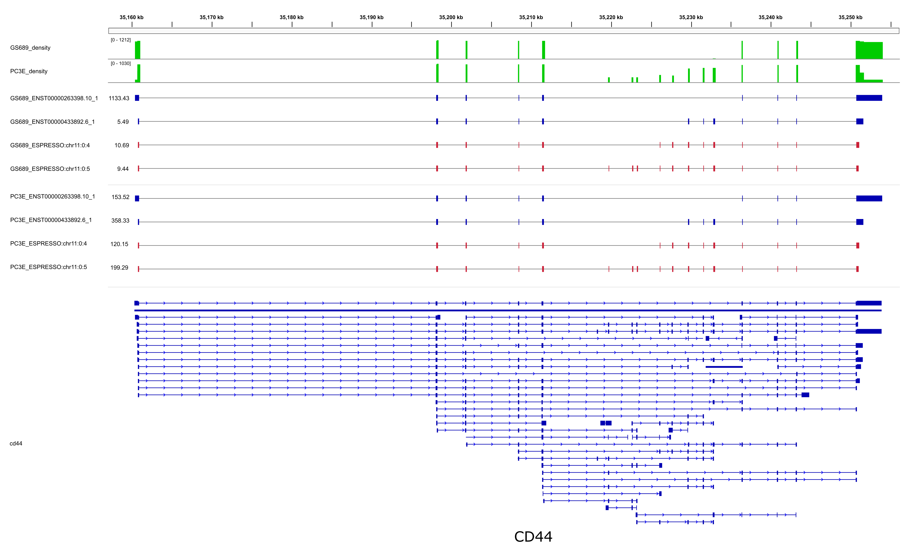

# Espresso Snakemake

## About

This is a Snakemake workflow for ESPRESSO. The workflow can start from fast5 files, a fastq file, a SAM file, or a BAM file. Each starting point requires a different configuration. The workflow can be configured to run multiple samples and each sample can have multiple inputs. Set the configuration by editing [snakemake_config.yaml](snakemake_config.yaml) and [snakemake_profile/config.yaml](snakemake_profile/config.yaml).

## Table of contents

* [Dependencies](#dependencies)
* [Install](#install)
* [Usage](#usage)
  + [Configuration](#configuration)
  + [Example](#example)
* [Output](#output)

## Dependencies

[Conda](https://docs.conda.io/projects/conda/en/latest/user-guide/install/linux.html) must be installed first. Then [./install](install) can install most other dependencies using conda. If needed then guppy can be installed manually.

## Install

[./install](install)

* Creates a conda environment with the required dependencies.
* Sets some absolute file paths in [snakemake_config.yaml](snakemake_config.yaml).

Guppy must be installed manually since a login is required to access the ONT software download page.

## Usage

Run the workflow with: [./run](run)

### Configuration

[snakemake_config.yaml](snakemake_config.yaml):

* Set the resources to allocate:
  - `{job_name}_threads: {num_threads}`
  - `{job_name}_mem_gb: {num_GBs}`
  - `{job_name}_time_hr: {num_hours}`
  - See "Resources" in [../README.md](../README.md) for estimates of memory and running time
* If any samples have fast5 input then set:
  - `guppy_bin_path: /path/to/guppy/bin/`
  - Also: `guppy_gpu: true` if using a GPU version of guppy
* Specify the .gtf and .fasta to use:
  + Provide the file names as `gtf_name:` and `fasta_name:`
  + Either place the files in `snakemake/references/`
  + Or provide a url under `reference_files:` to download the (potentially gzipped) files:
```
gtf_name: 'some_filename.gtf'
fasta_name: other_filename.fasta'
reference_files:
  some_filename.gtf.gz:
    url: 'protocol://url/for/some_filename.gtf.gz'
  other_filename.fasta.gz:
    url: 'protocol://url/for/other_filename.fasta.gz'
```
* Add a config entry for each input under `samples:`
* Samples with a fast5 input require:
  + `guppy_config: 'the_guppy.cfg'` (example: `rna_r9.4.1_70bps_fast.cfg`)
  + `fast5_dir: '/path/to/fast5/dir'`
* Samples with a fastq input require:
  + `fastq: '/path/to/the.fastq'`
* Samples with a SAM input require:
  + `sam: '/path/to/the.sam'`
* Samples with a BAM input require:
  + `bam: '/path/to/the.bam'`
* Here is an example config for running two samples where sample 1 has a single fastq input, and sample 2 includes both fast5 files and a BAM as input:
```
samples:
  first_sample_name:
    - fastq: '/path/to/the.fastq'
  second_sample_name:
    - guppy_config: 'rna_r9.4.1_70bps_fast.cfg'
      fast5_dir: '/path/to/fast5/dir'
    - bam: '/path/to/the.bam'
```
* Set any other config values:
  + `use_annotated_junctions_with_minimap2`: Use the junctions from the gtf as input to minimap2.
  + `keep_espresso_c_temp`: Keep temporary files from `espresso_c`.
  + `use_blast`: Use BLAST instead of Smith-Waterman in `ESPRESSO_C`
  + `use_alignment_read_groups`: Use overlapping alignment coordinates instead of gene coordinates from the GTF to determine read groups
  + `output_compatible_isoforms`: Produce the `samples_N2_R0_compatible_isoform.tsv` output file.
  + `output_corrected_sam_files`: Produce a sam file containing corrected alignments for each input
  + `enable_visualization`: Generate files for visualization. Requires setting other config values under "Visualization options"
  + `target_reads_per_espresso_c_job`: How many reads should be run in a single `ESPRESSO_C` job
  + `guppy_gpu_name`: Used to request the correct GPU if submitting jobs to a scheduler
  + `guppy_gpus`: How many GPUs to request per guppy job

The configuration used for running jobs in a cluster environment can be set by editing [snakemake_profile](snakemake_profile):

* [snakemake_profile/config.yaml](snakemake_profile/config.yaml): Sets various Snakemake parameters including whether to submit jobs to a cluster.
* [snakemake_profile/cluster_submit.py](snakemake_profile/cluster_submit.py): Script to submit jobs.
* [snakemake_profile/cluster_status.py](snakemake_profile/cluster_status.py): Script to check job status.
* [snakemake_profile/cluster_commands.py](snakemake_profile/cluster_commands.py): Commands specific to the cluster management system being used. The default implementation is for Slurm. Other cluster environments can be used by changing this file. For example, [snakemake_profile/cluster_commands_sge.py](snakemake_profile/cluster_commands_sge.py) can be used to overwrite `cluster_commands.py` to support an SGE cluster.

### Example

Unpack the test data:

* `cd test_data`
* `tar -xvf ./test_data_espresso_cd44.tar.gz`
* `mkdir ../snakemake/references`
* `cp ./test_data_espresso_cd44/cd44.gtf ../snakemake/references/`
* `cp ./test_data_espresso_cd44/cd44.fasta ../snakemake/references/`

Set the config [snakemake_config.yaml](snakemake_config.yaml):

* `gtf_name: 'cd44.gtf'`
* `fasta_name: 'cd44.fasta'`
*
```
samples:
  PC3E:
    - fastq: '/path/to/test_data/test_data_espresso_cd44/PC3E_1_cd44.fastq'
    - fastq: '/path/to/test_data/test_data_espresso_cd44/PC3E_2_cd44.fastq'
    - fastq: '/path/to/test_data/test_data_espresso_cd44/PC3E_3_cd44.fastq'
  GS689:
    - fastq: '/path/to/test_data/test_data_espresso_cd44/GS689_1_cd44.fastq'
    - fastq: '/path/to/test_data/test_data_espresso_cd44/GS689_2_cd44.fastq'
    - fastq: '/path/to/test_data/test_data_espresso_cd44/GS689_3_cd44.fastq'
```

Run:

* `cd ../snakemake`
* `./run`

Output:


The output file `espresso_out/q_work_dir/samples_N2_R0_abundance.esp` should be similar to [../test_data/expected_cd44_abundance.esp](../test_data/expected_cd44_abundance.esp).


This is a visualization created from the results:



The visualization can be created manually by following the instructions in [../README.md](../README.md) after running the workflow with the "Visualization options" set in [snakemake_config.yaml](snakemake_config.yaml).

## Output

* `espresso_out/s_work_dir/espresso_s_summary.txt`
* `espresso_out/c_work_dir/espresso_c_summary.txt`
* `espresso_out/q_work_dir/`
  + `samples_N2_R0_abundance.esp`
  + `samples_N2_R0_updated.gtf`
  + `samples_N2_R0_compatible_isoform.tsv`
  + `espresso_q_summary.txt`
* In addition to the output files there are also log files. The log files are written to the output directories and are named after the rules in [Snakefile](Snakefile). There will be a `{rule_name}_log.out` and `{rule_name}_log.err` with the stdout and stderr of the command run for that rule. There will also be a `.cluster.out`, `.cluster.err`, and `.cluster.usage` if the rule was submitted to the cluster using [snakemake_profile/cluster_submit.py](snakemake_profile/cluster_submit.py).
